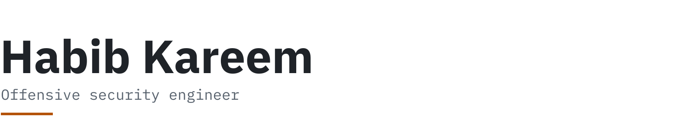
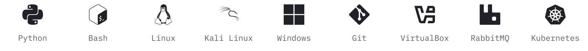

<h1>
  <picture>
    <source media="(prefers-color-scheme: dark)" srcset="assets/banner-dark.svg">
    
  </picture>
</h1>

Engineer by day. Researcher by night. Lately I've been more involved in building security controls into software products and the infrastructure that powers them. I've developed a growing interest in research at the intersection of AI/ML and privacy, and would welcome opportunities in this domain.

[Tools](#tools) · [Certifications](#certifications) · [Talks](#talks) · [Hack Wednesday](#hack-wednesday) · [Projects](#projects) · [Writing](#writing) · [Activity](#activity) · [Contact](#contact)

## Tools

<picture>
  <source media="(prefers-color-scheme: dark)" srcset="assets/tools-dark.svg">
  
</picture>

## Certifications

- [API Security Certified Professional (ASCP)](https://www.credly.com/badges/f052f458-d306-49a9-88fb-459d4e3a0ccd/public_url), APIsec University
- [Practical Junior Penetration Tester (PJPT)](https://certified.tcm-sec.com/bd2d4b39-0efe-47fb-b671-d5edbaeb03f8), TCM Security
- [Practical Help Desk Associate (PHDA)](https://certified.tcm-sec.com/d1cef95b-b7a3-4d53-b13c-e82459b7e56c#acc.CsU8OxvL), TCM Security
- [Certified in Cybersecurity (CC)](https://www.credly.com/badges/69bd2d67-e575-45e2-90c8-ad1d832c98b7/public_url), ISC2

## Talks

- [Through the Hacker's Lens - 2024 Learnings and 2025 Cybersecurity Vision](https://youtu.be/7OEAbuWATRI)\
  Discussed top vulnerabilities identified in 2024 IT infrastructures, exploitation methods, remediation, and predictions for offensive security trends in 2025.
- [Unmasking Cyber Threats: An Offensive Security Approach for Nigerian Businesses](https://youtu.be/qPk6HST5a-s)\
  Demonstrated and explained how limit overrun race condition can be exploited in web applications in the fintech space in Nigeria.

## Hack Wednesday

A live-stream series on [CyberPlural's YouTube channel](https://www.youtube.com/@cyberplural2671). Newest season first.

Season 2: API testing with the PortSwigger Web Security Academy (8 episodes)

1. [Season 2, episode 1, part 1](https://www.youtube.com/live/qpcTjp2uAl4)
2. [Season 2, episode 1, part 2](https://www.youtube.com/live/Mg9KXG-o2ZQ)
3. [Season 2, episode 2](https://www.youtube.com/watch?v=zbGR3EAAtBU)
4. [Season 2, episode 3](https://www.youtube.com/watch?v=E1Mu3TKrL-Y)
5. [Season 2, episode 4](https://www.youtube.com/live/GqmEEmt1HdU)
6. [Season 2, episode 5](https://www.youtube.com/live/E___wGZfv_4)
7. [Season 2, episode 6](https://www.youtube.com/watch?v=5DuD-mdU_8g)
8. [Season 2, episode 7](https://www.youtube.com/live/odCSYiMu-MY)

Season 1: Web LLM attacks (5 episodes)

1. [Season 1, episode 1](https://youtu.be/S70O1k5_J_Y)
2. [Season 1, episode 2](https://www.youtube.com/live/BGmvjwqOmXQ)
3. [Season 1, episode 3](https://www.youtube.com/live/rQZezE_TZaA)
4. [Season 1, episode 4](https://www.youtube.com/live/e76lUwbwooc)
5. [Season 1, episode 6](https://www.youtube.com/live/hLXa22Y2YTA)

## Projects

- [rke2-homelab-blueprint](https://github.com/bL34cHig0/rke2-homelab-blueprint)\
  Production-hardened RKE2 Kubernetes for homelabs: CIS hardening, automated TLS, Rancher, Longhorn, MetalLB and Prometheus/Grafana.
- [Pentest-Resources-Cheat-Sheets](https://github.com/bL34cHig0/Pentest-Resources-Cheat-Sheets)\
  A curated index of pentest and red-team cheat sheets, write-ups, tools and techniques.
- [Python3-Pentesting-tools](https://github.com/bL34cHig0/Python3-Pentesting-tools)\
  Small Python 3 pentesting tools from FreeCodeCamp's "Python for Penetration Testing" course.
- [Telstra-Cybersecurity-Virtual-Experience](https://github.com/bL34cHig0/Telstra-Cybersecurity-Virtual-Experience-)\
  A Python firewall rule that blocks requests exploiting Spring4Shell (CVE-2022-22965).

## Writing

- [Proving Impact Without Full Takeover: A Short XSS Story](https://bl34chig0.github.io/posts/Proving-Impact-Without-Full-Takeover-A-Short-XXS-Story/), January 2026
- [Leveraging AlwaysInstallElevated for Windows Privilege Escalation](https://blog.cyberplural.com/leveraging-alwaysinstallelevated-for-windows-privilege-escalation/), February 2025, on CyberPlural
- [Security Groups vs NACLs in AWS: Key Differences Explained](https://medium.com/@bl34chchig0/security-groups-vs-nacls-in-aws-key-differences-explained-d4ac767c0591), February 2025, on Medium
- [Active Directory Explained: Fine-Tuning Controls for Privileged Accounts](https://bl34chig0.github.io/posts/AD-Explained-Fine-Tuning-Control/), December 2024
- [Active Directory Explained, Part 3: Kerberos Authentication Protocol](https://blog.cyberplural.com/active-directory-explained-part-3-kerberos-authentication-protocol/), May 2024, on CyberPlural

Earlier posts (8)

- [IoT Meets Cloud: The Perfect Partnership](https://medium.com/@bl34chchig0/iot-meets-cloud-the-perfect-partnership-d18440bb7e11), January 2025, on Medium
- [Steganography: Hiding Messages in Plain Sight](https://medium.com/@bl34chchig0/steganography-hiding-messages-in-plain-sight-d237ac8097b3), November 2023, on Medium
- [Social Engineering, Part 2: Recognising and Defending Against Common Phishing Attacks](https://cysed.org/ncsam23-social-engineering-2/), October 2023, on CySED
- [Social Engineering, Part 1: The Sneaky Tactics Targeting Everyday People](https://cysed.org/ncsam23-social-engineering-1/), October 2023, on CySED
- [OSI Model: Understanding ISO's Conceptual Framework for Networking](https://medium.com/@bl34chchig0/osi-model-understanding-isos-conceptual-framework-for-networking-b8c11d3676a6), August 2023, on Medium
- [Hack Your Way into Cybersecurity: Mastering the Basics with Free Resources and Courses](https://medium.com/@bl34chchig0/hack-your-way-into-cybersecurity-mastering-the-basics-with-free-resources-courses-46adc787f063), August 2023, on Medium
- [Mastering Active Directory: Building Your Lab Environment, Part 2](https://medium.com/@bl34chchig0/mastering-active-directory-a-step-by-step-guide-to-building-your-ultimate-lab-environment-part-2-50b6a36f61e6), July 2023, on Medium
- [Mastering Active Directory: Building Your Lab Environment, Part 1](https://medium.com/@bl34chchig0/mastering-active-directory-a-step-by-step-guide-to-building-your-ultimate-lab-environment-part-1-9e99e85da384), July 2023, on Medium

Full archive on [my blog](https://bl34chig0.github.io/) and [Medium](https://medium.com/@bl34chchig0).

## Activity

<picture>
  <source media="(prefers-color-scheme: dark)" srcset="https://github-stats-extended.vercel.app/api?username=bL34cHig0&show_icons=true&custom_title=GitHub%20activity&bg_color=0d1117&border_color=3d444d&title_color=f0f6fc&text_color=9198a1&icon_color=f0a04b&ring_color=f0a04b">
  
</picture>

## Contact

<a href="https://linkedin.com/in/ha-bib"> LinkedIn</a> ·
<a href="https://twitter.com/itskhabib"> X (Twitter)</a> ·
<a href="https://bl34chig0.github.io/"> Blog</a>
